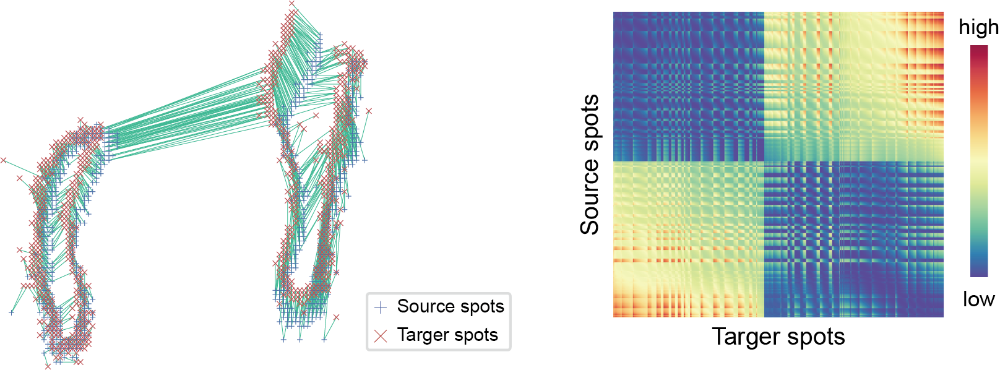

# Introduction

## Abstract
&emsp;Spatial transcriptomics revolutionizes transcriptomics by incorporating positional information. However, an emergency problem is to find out the gene expression pattern which can reveal the special region in tissue and find out the genes only expression in those regions. 

&emsp;Here we propose “**STMiner**” based on the Gaussian mixture model to solve this problem. STMiner is a bottom-up methodology algorithm. It is initiated by fitting a parametric model of gene spatial distributions and constructing a distance array between them utilizing the Hellinger distance. Genes are clustered, thereby recognizing spatial co-expression patterns across distinct gene classes.

&emsp;STMiner is implemented as an open-source Python package and is available for use at [STMiner](https://github.com/PSSUN/STMiner).

---

## Algorithm Detail

Overview of STMiner

&emsp;The spatial distribution of gene expression  was characterized using Gaussian Mixture Modeling (GMM), and a distance array was constructed by computing the Hellinger distance following the optimal matching of each GMM component. Each gene distribution within the distance array was projected into a lower-dimensional space and assigned distinct features.  
 
&emsp;Subsequently, genes were clustered based on their distribution features, and the expression pattern of each cluster was calculated.  
 
&emsp;Additionally, cross-modal data can also map to each other by STMiner under the mixture model.

### Find SVG

STMiner estimates the spatial variation level (SVL) by calculating the optimal transmission distance from gene spatial distribution to overall spatial distribution to identify the spatial variable genes. 

Find SVG by Optimal Transmission

### Fit the Guassian Mixture Model

GMM

Fit GMM

### Build the Distance Array 

Find SVG by Optimal Transmission

**Referance**:
 - Pardo, L. (2018). [Statistical Inference Based on Divergence Measures](https://books.google.com.hk/books?hl=zh-CN&lr=&id=ziDGGIkhqlMC&oi=fnd&pg=PP1&dq=Statistical+Inference+Based+on+Divergence+Measures&ots=m2kkDlPgy0&sig=uk9VT6URrdxIVZV4eMlxZJ1iHYk&redir_esc=y#v=onepage&q&f=false)
 - Wikipedia: [Hellinger distance](https://en.wikipedia.org/wiki/Hellinger_distance)

### Multidimensional scaling & Cluster the genes

&emsp;After the distance array was generated, STMiner find out the low dimensions embedding of distance array by Multidimensional Scaling.  
&emsp;Multidimensional scaling (MDS) is a means of visualizing the level of similarity of individual cases of a dataset. MDS is used to translate "information about the pairwise 'distances' among a set of n objects or individuals" into a configuration of n points mapped into an abstract Cartesian space.

&emsp;Here's an example that embedding 3D data into 2D use MDS:

<iframe allowtransparency="yes" frameborder="0" width="460" height="316" src="../_static/mds.html"/ style="text-align: center"></iframe>

High Dimension Data

2D embedding after MDS

&emsp;More technically, MDS refers to a set of related ordination techniques used in information visualization, in particular to display the information contained in a distance matrix. It is a form of non-linear dimensionality reduction.

**Referance**:
 - Borg, I.; Groenen P. Springer Series in Statistics (1997) [Modern Multidimensional Scaling - Theory and Applications](https://link.springer.com/book/10.1007/0-387-28981-X)
 - Kruskal, J. Psychometrika, 29 (1964) [Nonmetric multidimensional scaling: a numerical method](http://cda.psych.uiuc.edu/psychometrika_highly_cited_articles/kruskal_1964b.pdf)
 - Kruskal, J. Psychometrika, 29, (1964) [Multidimensional scaling by optimizing goodness of fit to a nonmetric hypothesis](http://cda.psych.uiuc.edu/psychometrika_highly_cited_articles/kruskal_1964a.pdf)
 - Wikipedia: [Multidimensional scaling](https://en.wikipedia.org/wiki/Multidimensional_scaling)

