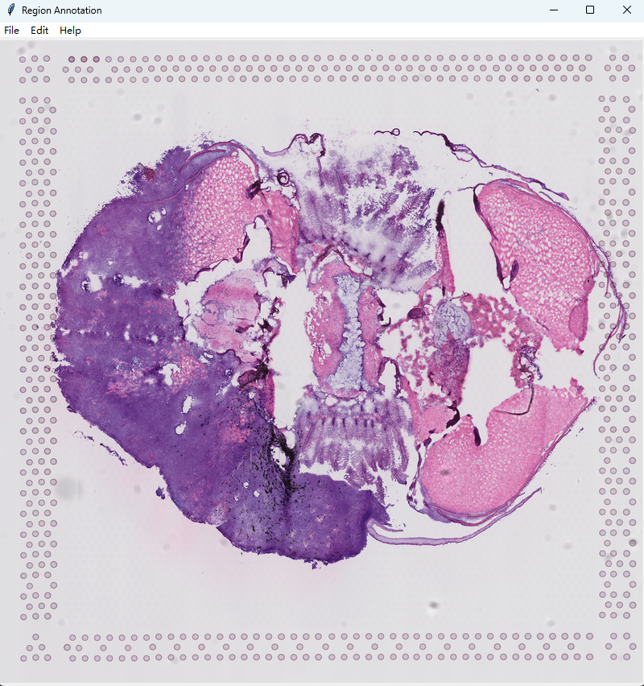
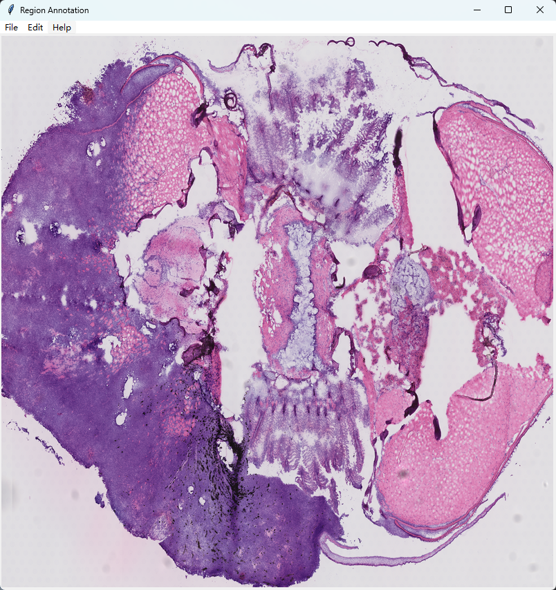

# Tutorial

## Rep11_MOB_ST

### import package

```python
from STMiner.SPFinder import SPFinder
```

### Load data

```python
file_path = 'I://human/10X_Visium_hunter2021spatially_sample_C_data.h5ad'
sp = SPFinder()
sp.read_h5ad(file=file_path)
```

### Fit GMM

```python
sp.fit_pattern(n_comp=20, n_top_genes=200, min_cells=200)

```
**n_comp**： Number of components for each GMM model
**min_cells**: Remove the genes that expressed spots counts less than [min_cells]


### Build distance array

```python
sp.build_distance_array()
```

### build distance matrix & clustering

```python
spf.cluster(n_clusters=6)
```
** n_clusters **


### Result & Visualization

The result are stored in **genes_labels**:

```python
spf.genes_labels
```

The output looks like the following:

|     | gene_id        | labels |
|-----|----------------|--------|
| 0   | Cldn5          | 2      |
| 1   | Fyco1          | 2      |
| 2   | Pmepa1         | 2      |
| 3   | Arhgap5        | 0      |
| 4   | Apc            | 5      |
| ..  | ...            | ...    |
| 95  | Cyp2a5         | 0      |
| 96  | X5730403I07Rik | 0      |
| 97  | Ltbp2          | 2      |
| 98  | Rbp4           | 4      |
| 99  | Hist1h1e       | 4      |

To visualize the patterns by heatmap:

```python
spf.plot_pattern(vmax=95)
```

To visualize the genes expression heatmap by labels:

```python
plot_heatmap(label=0, vmax=95)
```

### Marked region

```python
# Open the GUI of STMiner
sp.app.run()
```
Load the image in UI:

<div style="text-align: center"><p align="center">Load the image</p></div>

Cut the image:

<div style="text-align: center"><p align="center">Cut the image</p></div>

Mark the image:
