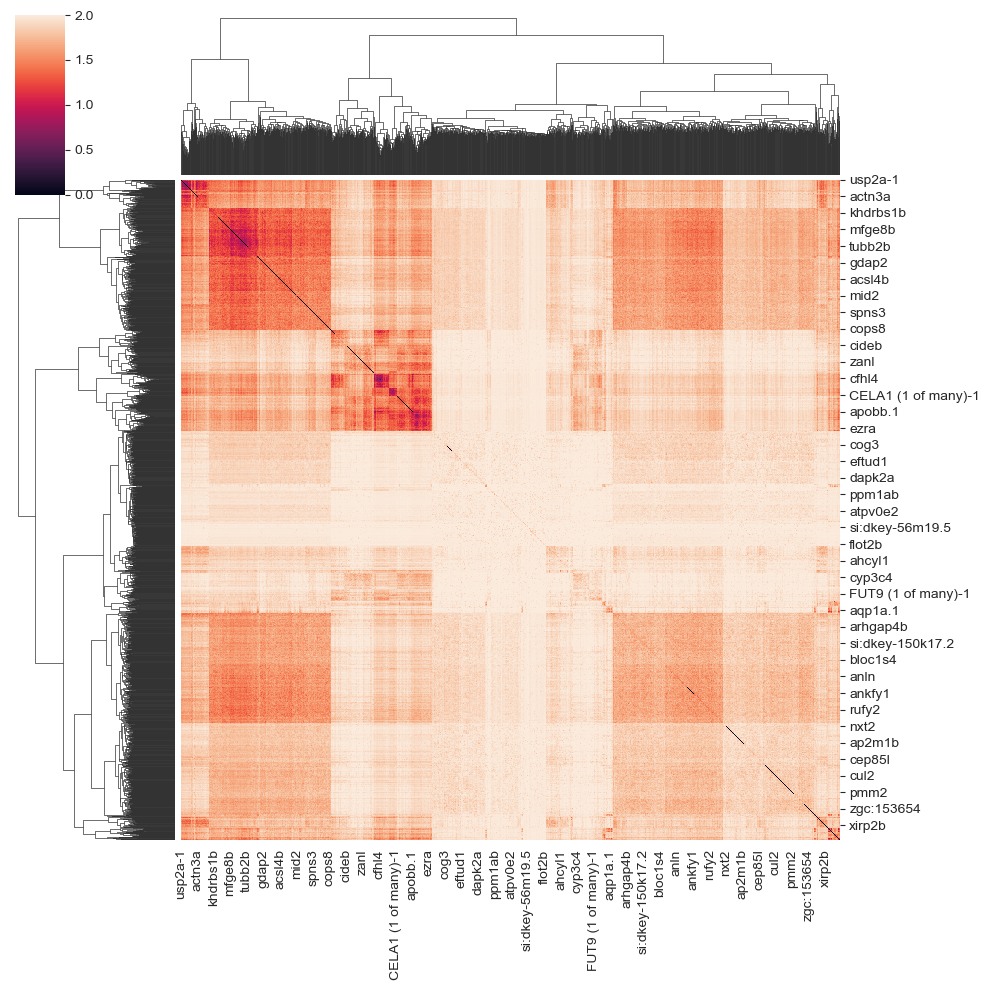

# Zebrafish melanoma

You can download them from [STMiner-test-data](https://github.com/PSSUN/STMiner-test-data). You can also download the raw dataset from [GEO](https://www.ncbi.nlm.nih.gov/geo/query/acc.cgi?acc=GSM4838133).

## Import package

```python
from STMiner.SPFinder import SPFinder
```

## Load data

```python
file_path = 'Path/to/your/h5ad/file'
sp = SPFinder()
sp.read_h5ad(file=file_path, bin_size=1)

```

 - The parameter **bin_size** specifies the size of merged cells (spots). If not specified, no merging is performed. If set to 50, 50x50 cells/spots will be merged into a single cell/spot. Due to low sequencing depth in some datasets, cells/spots are often merged during analysis (e.g., stereo-seq). However, 10x data typically does not require merging.
 - The ST datasets was storaged in **.adata** object of **sp**, you can use **sp.adata** to check them:

```python
sp.adata
```

Besides, **sp** Obj has many useful attributes which can be used for visualization or integrated into other pipelines (such as scanpy). See [API](https://stminerdoc.readthedocs.io/en/latest/API/API.html) for more details.

## Find SVG

```python
sp.get_genes_csr_array(min_cells=200, log1p=False)
sp.spatial_high_variable_genes(thread=6)
```
 - The parameter **min_cells** was used to filter genes that are too sparse to generate a reliable spatial distribution.
 - The parameter **log1p** was used to avoid extreme values affecting the results. For most open-source h5ad files, log1p has already been executed, so the default value here is False.
 - You can perform STMiner in your interested gene sets. Use parameter **gene_list** to input the gene list to STMiner. Then, STMiner will only calculate the given gene set of the dataset.
</br>
You can see output while computing as follows:

```bash
Parsing distance array...: 100%|██████████| 10762/10762 [01:12<00:00, 149.11it/s]
Computing ot distances...:  10%|▉         | 1069/10762 [03:04<31:11,  6.12it/s]  
```
You can check the spatial varitation of each gene by:

```python
sp.global_distance
```

| Gene       | Distance  | z-score   |
|------------|-----------|-----------|
| myha       | 1.35E+08  | 2.771493  |
| vmhcl      | 1.01E+08  | 2.470881  |
| zgc:101560 | 9.95E+07  | 2.458787  |
| pvalb1     | 9.82E+07  | 2.445257  |
| myhz2      | 9.75E+07  | 2.437787  |
| ...        | ...       | ...       |
| rps17      | 2.61E+05  | -3.63207  |
| rpl13      | 2.48E+05  | -3.68506  |
| rpl32      | 2.43E+05  | -3.70327  |
| rsl24d1    | 2.27E+05  | -3.7757   |
| rpl22      | 1.83E+05  | -3.99332  |


## Fit GMM

```python
sp.fit_pattern(n_comp=20, gene_list=list(sp.global_distance[:2000]['Gene']))
```

You can see output while computing as follows:

```bash
Fitting GMM...:  10%|▉         | 190/2000 [00:42<04:36,  6.54it/s] 
```

 - **n_comp**： Number of components for each GMM model
 - **gene_list**: Gene list to fit GMM model
</br>

## Build distance array

```python
sp.build_distance_array()
```
This step calculates the distance between genes' spatial distributions.
You can visualize the distance array by:

```python
import seaborn as sns
sns.clustermap(sp.genes_distance_array)
```

<div align=center></div>

## build distance matrix & clustering

```python
sp.cluster(n_clusters=6)
```

**n_clusters**: Number of cluster

## Result & Visualization

The result are stored in **genes_labels**:

```python
spf.genes_labels
```

The output looks like the following:

|     | gene_id        | labels |
|-----|----------------|--------|
| 0   | Cldn5          | 2      |
| 1   | Fyco1          | 2      |
| 2   | Pmepa1         | 2      |
| 3   | Arhgap5        | 0      |
| 4   | Apc            | 5      |
| ..  | ...            | ...    |
| 95  | Cyp2a5         | 0      |
| 96  | X5730403I07Rik | 0      |
| 97  | Ltbp2          | 2      |
| 98  | Rbp4           | 4      |
| 99  | Hist1h1e       | 4      |

To visualize the patterns by heatmap:

```python
sp.get_pattern_array()
sp.plot.plot_pattern(heatmap=False,
                     s=5,
                     rotate=True,
                     reverse_y=True,
                     reverse_x=True,
                     vmax=95,
                     cmap='Spectral_r',
                     output_path='./')
```

 - **heatmap**: If True, plot a heatmap. If False, plot a scatterplot. False is the default.
 - **s**: Spot size 
 - **rotate\reverse_y\reverse_x**: Adjust the axis of plot.
 - **cmap**: cmap of plot
 - **vmax**: The percentage of the highest value of plots. Avoid the effect of large values for visualization.
 - **output_path**: If set, save the figure to path
To visualize the genes by labels:

```python
sp.plot.plot_genes(label=0, n_gene=8, s=5, reverse_y=True, reverse_x=True)
```

**n_gene**: Number of genes to visualize


To visualize the specific gene (such as ***BRAFhuman***):
```python
hcc2l.plot.plot_gene('BRAFhuman', 
                     spot_size=10,
                     global_matrix_spot_size=10,
                     rotate=True, 
                     reverse_y=True, 
                     reverse_x=True, 
                     vmax=95, 
                     cmap='Spectral_r',
                     figsize=(5,5),
                     save_path='./',
                     format='png')
```

**reverse_y, reverse_x, rotate** is optional, they are used to adjust coordinate here.
